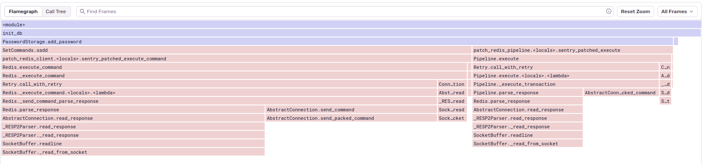
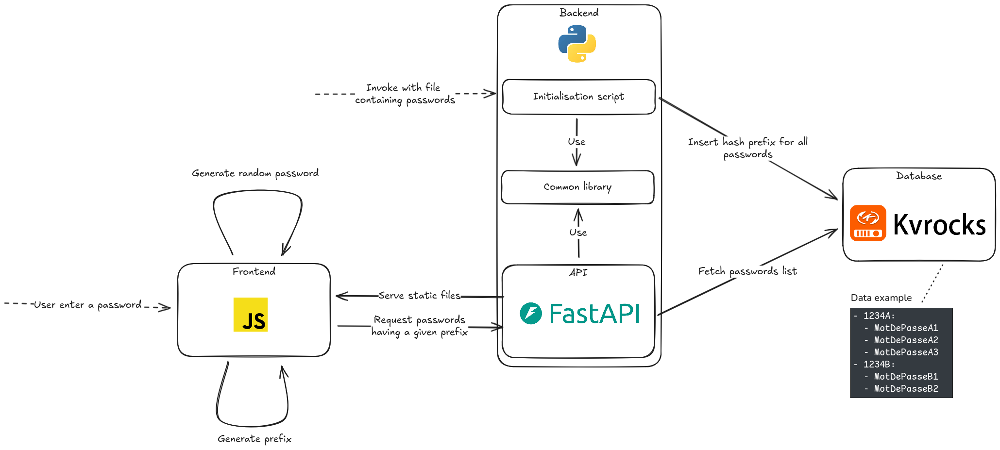

# Have I Been Pwned - clone

## Sommaire
1. [Démarche et choix effectués](#démarche-et-choix-effectués)
2. [Architecture](#architecture)
3. [Utilisation](#utilisation)
4. [Limite et améliorations possible](#limite-et-améliorations-possible)

## Démarche et choix effectués

### Gestion de projet

On utilisera [le projet Github](https://github.com/users/Hugo-C/projects/5) pour suivre les tâches à effectuer.
Une CI basique sera mise en place. Uniquement la branche master sera utilisée. On veillera a utiliser des messages de commit clairs.

Les conventions de code suivi sont:
* [PEP8](https://pep8.org/) pour Python
* [Airbnb](https://github.com/airbnb/javascript) pour JavaScript

### Partie fuite de mot de passe

Pour cette partie on suppose qu'un grand nombre de lecture (requête API) sera faîte comparé aux écritures. On a bien pris en compte la nécessité de garantir la confidentialité des mots de passe recherchés.  

La première étape entreprise est de regarder les choix fait par des solutions similaire. Il se trouve que le site haveibeenpwned.com [explique son fonctionnement](https://www.troyhunt.com/ive-just-launched-pwned-passwords-version-2/#cloudflareprivacyandkanonymity) et [est partiellement sur Github](https://github.com/HaveIBeenPwned/PwnedPasswordsAzureFunction).
On y apprend que des functions as a service sont utilisées pour récupérer des fichiers dans un service cloud. Par dessus, un CDN est utilisé comme cache. Une des raisons avancé de cette architecture est la maitrise des coûts. On va de notre coté rester sur une solution qui ne dépend pas d'un fournisseur cloud.  
Sur le site, la confidentialité des mots de passes est assurée par l'utilisation du préfixe d'un hash. Cela permet d'envoyer seulement quelques bytes de donnée commun à de multiples passwords. On constate que c'est la même méthode utilisée par [Google Safe Browsing](https://developers.google.com/safe-browsing/v4#update-api-v4). On retient donc cette façons de faire.

Pour le choix de la fonction de haschage, on retient MD5 et [xxHash](https://github.com/Cyan4973/xxHash) comme potentiel candidat de part leur rapidité d'éxécution. Effectivement, on n'a pas besoin d'une fonction de hachage cryptographique, mais seulement qu'elle soit à sens unique, pour la confidentialité des passwords soumit, et qu'elle est une bonne uniformité en sortie pour répartir les données en DB. Les collisions ne sont pas un problème ici, car on cherche au contraire à en générer en utilisant le préfixe.   
On test les deux fonctions via un [benchmark](doc/benchmark.py) en utilisant 15 caractère comme taille de mot de passe de façons arbitraire:
```
$ pyperf timeit -s 'import benchmark; p = benchmark.random_password(15)' 'benchmark.hash_md5(p)'
.....................
Mean +- std dev: 782 ns +- 18 ns
```
vs
```
pyperf timeit -s 'import benchmark; p = benchmark.random_password(15)' 'benchmark.hash_xxh(p)'
.....................
Mean +- std dev: 403 ns +- 12 ns
```
Le gain étant relativement important (~50% plus rapide), on choisi d'utiliser xxHash. 

> A noter que je m'étais trompé à cette étape, en incluant la génération du mot de passe dans le benchmark, ce qui faussait la comparaison avec MD5 qui n'était plus lent que de seulement 6%.  
> Avec un si faible écart MD5 aurait était retenu étant donné qu'il est bien plus répandu.  

On va utiliser comme préfixe les 5 premier caractère hexadécimaux des hashes, cela donne 16<sup>5</sup>=1 048 576 combinaisons possibles. On devrait ainsi avoir en moyenne un peu moins de 14 mots de passes retournés avec la liste rockyou utilisé.

Pour la base de donnée il nous faut donc un moyen d'associer un préfixe de hash à un ensemble de mot de passe à la manière d'une HashMap. Cela permet de faire le gros du travail une seule fois à l'initialisation et d'ensuite répondre au client rapidement. Au vu de la quantité de donnée (14 millions de mots de passe) et du fait que certains préfixe seront sans doute demandé plus que d'autre, on préfère ne pas les stocker en mémoire. Cela élimine une HashMap dans le code et dans une certaine mesure Redis. Une base SQL type PostgreSQL a été considérée, avec des rows qui pourrait ressembler à `<Password as Primary Key> | <Hash prefix>`. En utilisant un index sur le préfixe et en utilisant la bonne taille de varchar les performances doivent être acceptable pour ce jeu de donnée. Cependant on suppose qu'on voudra ajouté d'autres sources de données plus tards et donc cette solution n'est pas idéale.  
On propose d'utiliser [Kvrocks](https://github.com/apache/kvrocks) qui est une surcouche de [rocksdb](https://rocksdb.org/). Cette base de donnée est équivalente à Redis avec un stockage sur disque. De plus, elle intégre nativement [un cache LRU](https://github.com/facebook/rocksdb/wiki/Block-Cache#lru-cache) ce qui est particulièrement adapté à notre situation et simplifie l'architecture global en enlevant le besoin d'avoir un cache dédié.

Pour le backend on utilise Python et FastAPI pour une question de simplicité de ces outils.

---

Lors de la création du script d'initialisation, arrive le moment de faire le premier test avec le jeu de donnée complet (Voir [commit](https://github.com/Hugo-C/HIBP/commit/7f5db7e5eecfada55918ec67b2e98cba9b911c9e)). Le script est relativement lent et je l'arrete après quelques minutes. En essayant sur 100k entrée le script prend 34s, ce qui donnerai 80mins avec les 14M d'entrées.
J'utilise un outils de profiling (en l'occurence Sentry car je l'avais sous la main). Il montre que plus de 90% du temps est passé dans `PasswordStorage.add_password`:

 

Plusieurs solutions sont envisagées. La première est de pousser les données en batch, ce qui nécessite avec `sadd` de pousser plusieurs password qui ont le même prefix. Cette solution parait compliqué à mettre en place, car elle oblige a stocker beaucoups d'informations en mémoire. D'autres solutions comme utiliser de l'asynchrone, ou encore du multiprocessing implique une forte complexité supplémentaire. Par exemple découper le fichier en entrée en une centaine de mini fichiers pour être traité par des "workers" différents. Heureusement Redis fournit un système de batch de commande via [les pipelines](https://redis.io/docs/latest/develop/use/pipelining/) qui permet d'avoir des commandes différentes dans un seul appel. Après quelques essaie, des batchs de 200 commandes semble être le bon compromis qui permet de faire 100k password en 3s, ce qui est plus acceptable.

---

Pour la partie frontend, je n'ai pas réussie à mon grand regret à utiliser la librairie npm dans le navigateur d'une manière compatible avec Jest. Je me suis rabattu sur `browserify` puis sur `esbuild`.

### Partie génération de mot de passe

TODO

## Architecture



## Utilisation

TODO

### Initialisation de la base de donnée

TODO

### Setup dev

`poetry sync` permet d'installer les dépendances, justfile (voir [ici pour l'installation](https://github.com/casey/just?tab=readme-ov-file#cross-platform)) permet de faire tourner les tests et le linter.  
`npm install` permet d'installer les dépendances coté frontend.

## Limite et améliorations possible

Le fichier docker compose est fonctionnel mais pourrait être améliorer pour de la production, notamment en ajoutant un mot de passe à la connection, customiser les paramètres par défaut, utiliser de la réplication pour de la haute disponibilité, ...
Le script d'initialisation est de manière séquentielle. On peut améliorer les performances en utilisant de l'asynchrone et/ou du multithread pour paralleliser la calcul des hashs et l'insertion en DB au prix d'une plus grande complexité du code.